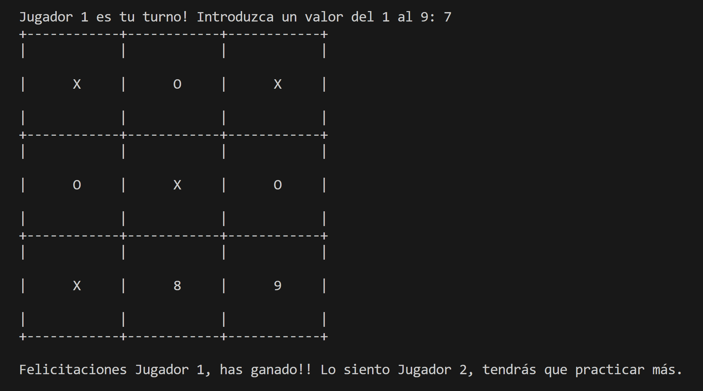
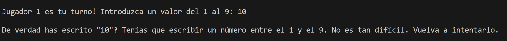
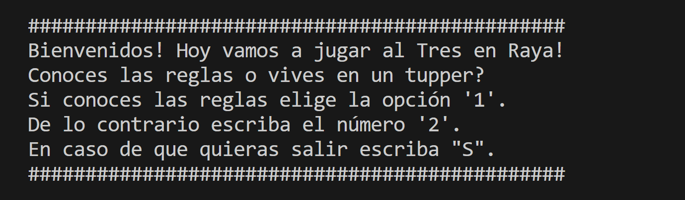
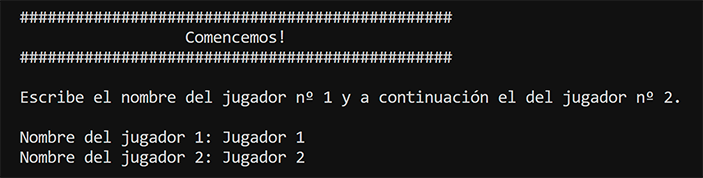
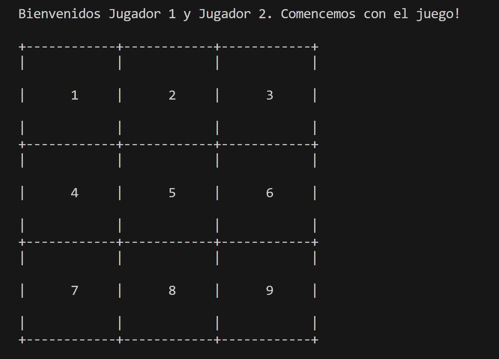
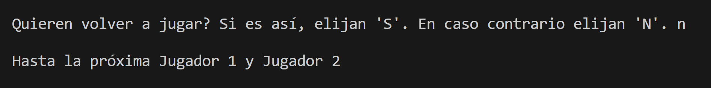

# Juego Tres en Raya

##### Es un juego realizado con Python que se compone de 4 funciones que dan lugar a un intercambio interactivo por consola emulando al clásico juego.  
  
  

##### Una de las características que lo destacan es su carácter poco amigable e impaciente hacia los errores. Podés jugar y divertirte pero es mejor que no te equivoques porque la terminal te lo hará saber.  

  

##### Inicialmente el juego nos da una cálida bienvenida:  

  

##### Seguido de esto nos pide añadir los nombres de los 2 jugadores.  

  

##### Nos da la bienvenida y comienza el juego.  

  

##### Una vez finalizado nos pregunta si querémos finalizar o volver a jugar.  

   

